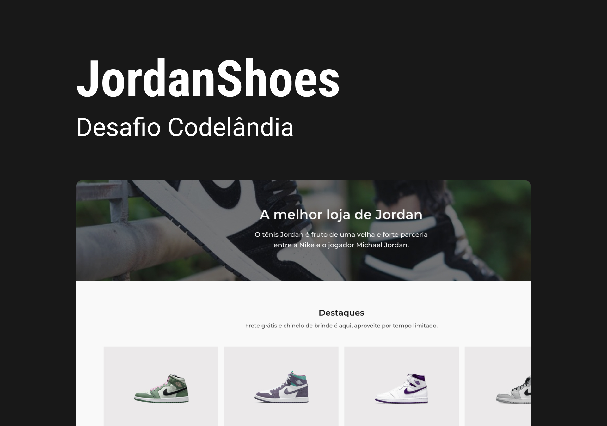

<h1 align="center">
  Desafio - JordanShoes
</h1>

  

  

  

  <a href="#rocket-sobre-o-desafio">Sobre o desafio</a>&nbsp;&nbsp;&nbsp;|&nbsp;&nbsp;&nbsp;
  <a href="#deploy">Deploy</a>&nbsp;&nbsp;&nbsp;|&nbsp;&nbsp;&nbsp;
  <a href="#art-layout">Layout</a>&nbsp;&nbsp;&nbsp;|&nbsp;&nbsp;&nbsp;
  <a href="#memo-licença">Licença</a>

 

## :rocket: Sobre o desafio

Reproduzir layout contendo uma landing page de uma loja de shoes.

### Funcionalidades da aplicação

- **`Responsividade`**

- **`Animações`**

### Nesse projeto foi utilizado

- **`React JS`**

- **`Vite`**

- **`Framer Motion`**

- **`Tailwind CSS`**

 

## :art: Layout

Para acessar o layout do projeto no figma **[clique aqui](https://www.figma.com/file/oAJWmuLYxmYROHoc9bIVAH/Codel%C3%A2ndia---Desafio-02?type=design&node-id=0%3A1&t=0JmmOOD0DBPo81eh-1)**

Layout desenvolvido por [Iuri Code](https://www.instagram.com/iuricode/)

 
## :memo: Licença

Esse projeto está sob a licença MIT. Veja o arquivo [LICENSE](LICENSE) para mais detalhes.

---
Feito por [Lucas Samuel](https://github.com/lucassamuel94)
